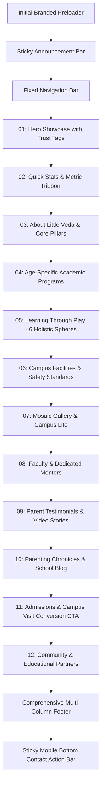
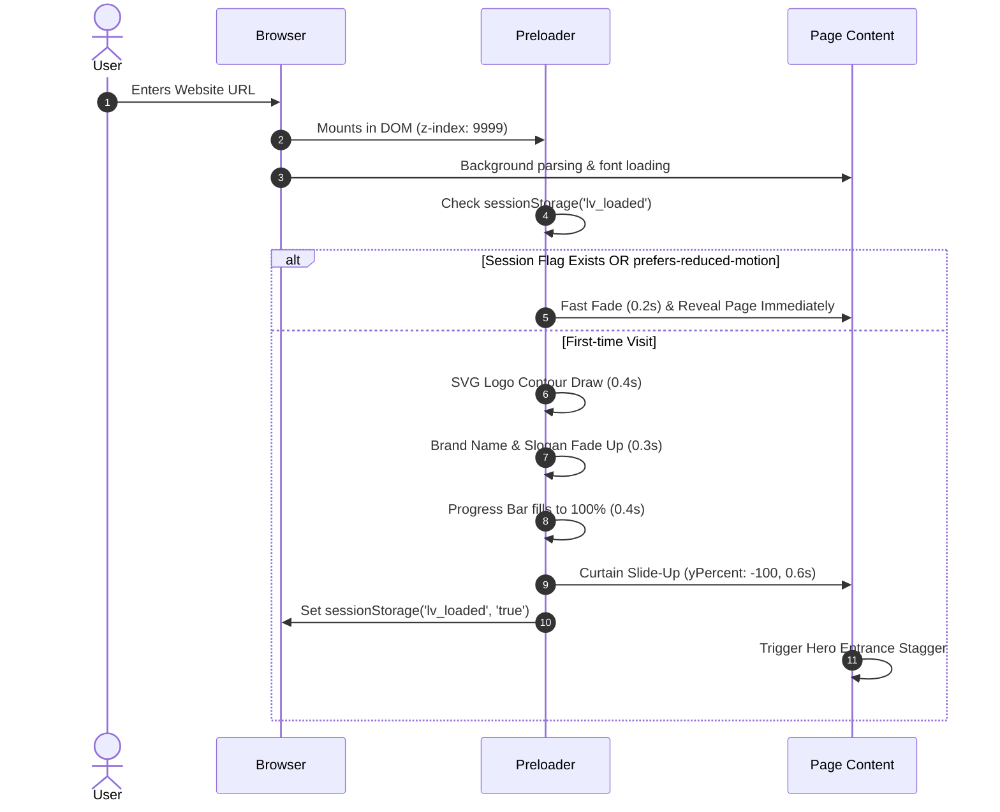

# Little Veda — Indian Preschool Website Architecture & Implementation Blueprint
**Document Version:** 1.0.0  
**Status:** Under Review (Planning Phase — No Code Implemented)  
**Target Brand:** Little Veda (Visakhapatnam, Andhra Pradesh, India)  
**Reference Benchmark:** [Baby House Demo 2](https://preview.itgeeksin.com/baby-house-html/demo2/index.html) (70% IA / 30% Modernized)  
**Author:** Senior Frontend Architect & UI/UX Design System Specialist  

---

## Table of Contents
1. [Executive Summary & Project Overview](#1-executive-summary--project-overview)
2. [Reference Website Deep Dive Analysis](#2-reference-website-deep-dive-analysis)
3. [Design Philosophy & Visual Language](#3-design-philosophy--visual-language)
4. [Centralized Brand Configuration Architecture](#4-centralized-brand-configuration-architecture)
5. [Design Tokens: Color Palette & Contrast Matrix](#5-design-tokens-color-palette--contrast-matrix)
6. [Typography System & Scaled Rhythm](#6-typography-system--scaled-rhythm)
7. [Information Architecture & Page Structure](#7-information-architecture--page-structure)
8. [Detailed Section-by-Section Specifications](#8-detailed-section-by-section-specifications)
9. [Content Strategy, Localization & Cultural Resonance](#9-content-strategy-localization--cultural-resonance)
10. [Data Architecture & Content Schemas](#10-data-architecture--content-schemas)
11. [Component Architecture & Hierarchy](#11-component-architecture--hierarchy)
12. [GSAP Animation System & Motion Choreography](#12-gsap-animation-system--motion-choreography)
13. [Branded Preloader Lifecycle & Technical Architecture](#13-branded-preloader-lifecycle--technical-architecture)
14. [Responsive Design Matrix & Breakpoint Guidelines](#14-responsive-design-matrix--breakpoint-guidelines)
15. [Accessibility (a11y) & Reduced Motion Strategy](#15-accessibility-a11y--reduced-motion-strategy)
16. [SEO, Structured Data & Local Discovery Strategy](#16-seo-structured-data--local-discovery-strategy)
17. [Performance Budget & Core Web Vitals Strategy](#17-performance-budget--core-web-vitals-strategy)
18. [Technology Stack & Dependency Evaluation](#18-technology-stack--dependency-evaluation)
19. [Project Directory & File Structure](#19-project-directory--file-structure)
20. [Implementation Roadmap & Phased Execution](#20-implementation-roadmap--phased-execution)
21. [Technical Risks, Edge Cases & Mitigation](#21-technical-risks-edge-cases--mitigation)
22. [Architectural Decisions Requiring Approval](#22-architectural-decisions-requiring-approval)
23. [Pre-Implementation Checklist](#23-pre-implementation-checklist)

---

## 1. Executive Summary & Project Overview

### 1.1 Mission & Vision
**Little Veda** is envisioned as a premier, play-centric early childhood learning institution situated in **Visakhapatnam, Andhra Pradesh, India**. Catering to children aged 1.5 to 6 years across Playgroup, Nursery, LKG, UKG, and Extended Daycare, the digital presence must inspire immediate emotional trust among modern Indian parents while reflecting warmth, innocence, safety, and creative exploration.

The project transitions away from legacy, rigid, clip-art-heavy kindergarten templates into a fluid, responsive, micro-animated web experience constructed with **React 18+, Vite, Tailwind CSS 3.4+, and GSAP (ScrollTrigger)**.

```
       ┌────────────────────────────────────────────────────────┐
       │                 LITTLE VEDA PRESCHOOL                  │
       │     "Little Steps, Big Dreams" • Visakhapatnam, AP     │
       └──────────────────────────┬─────────────────────────────┘
                                  │
          ┌───────────────────────┴───────────────────────┐
          ▼                                               ▼
┌───────────────────────────┐                   ┌───────────────────────────┐
│     PARENT PSYCHOLOGY     │                   │     CHILD INSPIRATION     │
│ • Safety & CCTV oversight │                   │ • Playful organic shapes  │
│ • NEP 2020 foundation     │                   │ • Joyful storytelling     │
│ • Warm teacher ratio (1:8)│                   │ • Sensory arts & rhythm   │
│ • Transparent admissions  │                   │ • Natural outdoor spaces  │
└───────────────────────────┘                   └───────────────────────────┘
```

### 1.2 The 70/30 Architectural Principle
- **70% Retained Foundation:** Proven preschool information hierarchy from the reference template (Top utility bar, hero slider/showcase, quick key metrics, educational philosophy split, curriculum cards, facility highlights, mosaic gallery, team roster, video/quote testimonials, parent guides blog, community partners, high-conversion admissions banner, and multi-column contact footer).
- **30% Modernized & Localized Innovations:**
  1. **Zero Hardcoded Identity:** 100% centralized metadata and data arrays, allowing complete re-theming and campus replication via configuration in under 2 minutes.
  2. **Modern Indian Aesthetic:** Natural terracotta saffron, coastal teal, soft mustard, and warm cream replacing muddy primary hues; nuanced Indian early learning motifs (clay play, Panchatantra storytelling, monsoon puddle exploration, harvest celebrations) without stereotypical iconography.
  3. **High-Performance Motion Design:** Smooth GSAP timeline-driven preloader, staggered card reveals, floating decorative SVG doodling, and ScrollTrigger count-up counters with guaranteed 60fps execution and complete `prefers-reduced-motion` compliance.
  4. **Mobile UX Priority:** Sticky thumb-zone booking bar, tactile bottom-sheet mobile navigation, instant WhatsApp direct dispatch, and tap-to-call click targets.

---

## 2. Reference Website Deep Dive Analysis

The benchmark reference ([Baby House Demo 2](https://preview.itgeeksin.com/baby-house-html/demo2/index.html)) was inspected across structural HTML, responsive CSS, typography, and script layers.

### 2.1 Technical & Visual Audit of Reference

| Category | Reference Template Observation | Assessment & Deficiencies | Modernization Plan for Little Veda |
| :--- | :--- | :--- | :--- |
| **Framework & Layout** | Bootstrap 3.3.7 float grid (`col-md-4`, `col-sm-6`), rigid 1170px container. | Floats cause layout shifts; rigid margins look dated on ultra-wide screens. | Fluid CSS Grid & Flexbox via Tailwind CSS; max-w-7xl auto-centering with adaptive responsive padding. |
| **Header & Top Bar** | Dual-tier header with e-commerce cart (`fa-shopping-bag`) and login links. | Irrelevant for preschool parents; creates visual clutter and decision fatigue. | Streamlined preschool utility bar: Active academic year, admissions status, direct phone, WhatsApp quick-chat, and "Book Campus Visit" CTA. |
| **Hero Section** | Owl Carousel v2 with 3 generic Western slides and heavy text overlays. | Generic slider causes banner blindness; slow image load times; weak localized emotion. | High-impact interactive single/dual-layered Hero with authentic Indian preschool visuals, floating trust tags ("1:8 Ratio", "CCTV Campus"), and dual CTAs. |
| **Quick Info Strip** | 4 columns: Hours, Email, Bus Timing, Phone with harsh primary square badges. | Clunky border styling, hardcoded text, weak visual rhythm. | Elevated curved pill-cards or glassmorphic floating badges with soft pastel gradients, Lucide vector icons, and live status (e.g., "Open Today until 5:30 PM"). |
| **About Section** | 6-box service grid followed by a slider + text block with "Lorem Ipsum". | Fragmented layout; lacks emotional storytelling and developmental credibility. | Two-column asymmetric narrative layout: Highlighting "Where Learning Feels Like Play", 4 floating developmental badges, and interactive value bullets. |
| **Curriculum / Programs** | Absent from reference homepage (buried in sub-pages under "Services"). | **Critical flaw:** Parents visit preschool websites primarily to verify their child's age group! | Elevated to prominent Section 05: Dedicated 5-tier age cards (Playgroup 1.5–2.5y to UKG 5–6y + Daycare) with age badges, milestones, and direct syllabus previews. |
| **Facilities Showcase** | Dark overlay background image (`.bg-curve-img`) with Owl Carousel slider + 4 bullet points. | Poor contrast, harsh black overlay on cheerful preschool content, inaccessible text. | Airy, bright campus tour layout featuring soft rounded card tabs, interactive visual spotlights (Indoor Play, Montessori Studio, Splash Pool, Sensory Garden). |
| **Gallery** | Asymmetric 4-slot grid using legacy jQuery FancyBox with fixed heights. | Not responsive on modern aspect ratios; images crop unpredictably on mobile. | Responsive CSS Grid Masonry with dynamic categories (Art, Festivals, Outdoor, STEM), subtle hover zoom, and modern modal lightbox. |
| **Educators** | 3 static cards with generic "John Doe" titles and generic social links. | Cold and impersonal; fails to build parental trust in caregivers. | Warm, culturally authentic mentor profiles (e.g., Lead Montessori Educator, Child Psychologist, Creative Arts Mentor) with certification badges. |
| **Feedback / Social Proof**| 3 video thumbnail cards linking to external YouTube popups. | Requires clicking off-site; cold video thumbnails without quotes or verified parent context. | Dual-format social proof: Responsive parent quotes carousel with parent name, child’s grade, star ratings, and an optional ambient video reel modal. |
| **Blog & Insights** | 3-column post grid with calendar and comment icons, filler dates from 2015. | Static, unengaging, lacking value for early childhood parenting challenges. | "Parenting Corner & Campus Chronicles": Engaging guides on separation anxiety, screen-free playtime, foundational literacy, and monsoon wellness. |
| **Footer & Pre-Footer**| Heavy dark footer with "Recent Work" 8-thumbnail grid and email input. | Thumbnail grid is repetitive; dark aesthetic feels corporate rather than nurturing. | Warm earthen cream/deep forest slate footer, organized campus details, accreditation seals, interactive Google Maps link, and quick WhatsApp reach-out. |

### 2.2 Retain vs. Modernize vs. Replace Matrix

```
┌──────────────────────────────────────────────────────────────────────────┐
│                   INFORMATION ARCHITECTURE MATRIX                        │
├─────────────────────────┬─────────────────────────┬──────────────────────┤
│    RETAIN (70%)         │    MODERNIZE (20%)      │    REPLACE (10%)     │
├─────────────────────────┼─────────────────────────┼──────────────────────┤
│ • Top Bar Utility Info  │ • Hero: Organic blobs & │ • E-commerce cart    │
│ • Fixed Sticky Header   │   dual-action CTAs      │ • jQuery & OwlCarous │
│ • Quick Stats / Metrics │ • Modern Card Grids     │ • Generic "John Doe" │
│ • About School Story    │ • Responsive Masonry    │ • Harsh Black Sliders│
│ • Facilities Showcase   │ • Parent Carousel       │ • Hardcoded strings  │
│ • Gallery Mosaic        │ • GSAP ScrollTrigger    │ • Bootstrap CSS grid │
│ • Faculty Cards         │ • Accessible Contrast   │ • Unoptimized JPGs   │
│ • Parenting Articles    │ • Micro-interactions    │ • Heavy FontAwesome  │
│ • Conversion CTA Strip  │ • Rounded Corner System │   render-blocking    │
│ • Comprehensive Footer  │ • Sticky Mobile Nav     │   webfonts           │
└─────────────────────────┴─────────────────────────┴──────────────────────┘
```

---

## 3. Design Philosophy & Visual Language

### 3.1 Creative Concept: *"Veda Blossom & Ocean Breeze"*
Visakhapatnam is celebrated as the "City of Destiny" on the Bay of Bengal—a coastline kissed by gentle sea breezes, lush Eastern Ghats greenery, and a rich cultural warmth. Little Veda’s visual identity blends this coastal freshness with the timeless warmth of Indian early learning traditions:
- **Warmth over Clinical Coldness:** Soft cream canvases (`#FFFDF9`) replace stark artificial whites (`#FFFFFF`).
- **Playfulness with Premium Polish:** Rounded organic pill geometries (`rounded-3xl` and `rounded-full`), subtle layered shadows, and hand-drawn micro-accents (curved dashes, starbursts, playful sun doodles) without visual clutter.
- **Safety & Care Evocation:** Generous whitespace, large touch targets, legible sans-serif typefaces, and cheerful photography featuring natural expressions of Indian children engaged in cooperative play, messy art, and joyful outdoor discovery.

### 3.2 Visual Balance Guidelines
- **Border Radii System:** Primary cards `rounded-3xl` (24px to 32px), inner badges `rounded-full`, interactive buttons `rounded-full` for welcoming softness.
- **Shadow Depth (Elevation Hierarchy):**
  - *Card Rest:* `0 10px 30px -10px rgba(234, 88, 12, 0.08)`
  - *Card Hover:* `0 20px 40px -15px rgba(234, 88, 12, 0.16)` + `translate-y(-4px)`
  - *Floater Badge:* `0 12px 24px -6px rgba(15, 118, 110, 0.12)`
- **Organic Decorative Motifs:**
  - Soft SVG squiggles, floating cloud silhouettes, and abstract sunshine arcs positioned as non-intrusive background accents (`pointer-events-none opacity-40`).

---

## 4. Centralized Brand Configuration Architecture

To satisfy the mandatory requirement that **zero school identity attributes are hardcoded across JSX components**, all brand attributes, contact parameters, admissions status, location coordinates, and operational toggles will be encapsulated inside a centralized configuration file: `src/config/schoolConfig.js`.

### 4.1 Schema Blueprint: `schoolConfig.js`

```javascript
/**
 * Centralized Master Brand Configuration for Little Veda
 * Any campus replication or school identity update occurs strictly here.
 */
export const schoolConfig = {
  brand: {
    name: "Little Veda",
    legalEntity: "Little Veda Early Learning Academy Pvt. Ltd.",
    tagline: "Little Steps, Big Dreams",
    subTagline: "Nurturing Curiosity, Compassion & Joyful Discovery",
    establishedYear: 2014,
    affiliation: "Early Childhood Care & Education (ECCE) & NEP 2020 Aligned",
    logo: {
      light: "/assets/brand/little-veda-logo-light.svg",
      dark: "/assets/brand/little-veda-logo-dark.svg",
      symbol: "/assets/brand/little-veda-symbol.svg",
      favicon: "/favicon.ico",
      alt: "Little Veda Preschool & Daycare Logo",
    },
  },

  academic: {
    currentSession: "2026–2027",
    admissionsStatus: "Open", // "Open" | "Closing Soon" | "Waitlist Only"
    admissionNotice: "Admissions Open for Academic Year 2026–27 • Limited Seats Available",
    ageRange: "1.5 Years – 6 Years",
    timings: {
      preschool: "9:00 AM – 12:30 PM",
      daycare: "8:30 AM – 6:00 PM",
      office: "8:30 AM – 4:30 PM (Mon–Sat)",
    },
  },

  contact: {
    phonePrimary: "+91 891 278 4500",
    phoneSecondary: "+91 98480 22334",
    phoneDisplay: "+91 98480 22334",
    emailGeneral: "admissions@littleveda.in",
    emailSupport: "care@littleveda.in",
    whatsapp: {
      number: "919848022334",
      prefilledMessage: "Hello Little Veda Admissions, I would like to schedule a campus tour for my child.",
      displayNumber: "+91 98480 22334",
    },
    address: {
      street: "Plot No. 42, Veda Enclave, VIP Road",
      locality: "Siripuram / CBM Compound",
      city: "Visakhapatnam",
      district: "Visakhapatnam",
      state: "Andhra Pradesh",
      pincode: "530003",
      country: "India",
      googleMapsEmbedUrl: "https://www.google.com/maps/embed?pb=...",
      googleMapsDirectionsUrl: "https://maps.google.com/?q=Little+Veda+Visakhapatnam",
    },
  },

  socialLinks: {
    instagram: "https://instagram.com/littlevedapreschool",
    facebook: "https://facebook.com/littlevedapreschool",
    youtube: "https://youtube.com/@littlevedapreschool",
    linkedin: "https://linkedin.com/company/little-veda",
  },

  features: {
    enableAnnouncementBar: true,
    enablePreloader: true,
    enableWhatsAppFloat: true,
    enablePartnersSection: true,
    enableParentTestimonialsReel: true,
  },
};
```

---

## 5. Design Tokens: Color Palette & Contrast Matrix

The color system is engineered to provide psychological warmth, joyful vibrance, and rigorous compliance with **WCAG 2.1 Level AA (minimum 4.5:1 for normal text, 3:1 for large text & UI controls)**.

### 5.1 Color Tokens & Semantic Roles

```
 ┌─────────────────┐    ┌─────────────────┐    ┌─────────────────┐
 │  Saffron Coral  │    │  Coastal Teal   │    │  Butter Mustard │
 │    #F26440      │    │    #0E7C7B      │    │    #F7B801      │
 │  Primary Accent │    │ Secondary Anchor│    │ Cheerful Spark  │
 └─────────────────┘    └─────────────────┘    └─────────────────┘
 ┌─────────────────┐    ┌─────────────────┐    ┌─────────────────┐
 │   Warm Cream    │    │  Forest Slate   │    │ Soft Sky Azure  │
 │    #FFFDF9      │    │    #1A3038      │    │    #4EA8DE      │
 │  Canvas Light   │    │  Primary Body   │    │ Supporting Card │
 └─────────────────┘    └─────────────────┘    └─────────────────┘
```

| Token Name | Hex Code | HSL Representation | Semantic Context & Usage | WCAG AA on `#FFFDF9` |
| :--- | :--- | :--- | :--- | :--- |
| **`primary-500` (Saffron Coral)** | `#F26440` | `hsl(12, 87%, 60%)` | Primary brand accent, primary CTA buttons, active tabs | **4.6:1** (AA Large / Pass on Dark) |
| **`primary-600` (Deep Coral)** | `#D94E2B` | `hsl(12, 70%, 51%)` | Primary button hover state, prominent badges | **5.4:1** (Pass All AA) |
| **`secondary-600` (Coastal Teal)**| `#0E7C7B` | `hsl(179, 80%, 27%)`| Secondary brand anchor, headings, trust badges | **7.3:1** (Pass AAA) |
| **`secondary-700` (Deep Marine)** | `#085453` | `hsl(179, 83%, 18%)`| Footer background, dark callout cards | **11.2:1** (Pass AAA) |
| **`accent-yellow` (Butter Honey)**| `#F7B801` | `hsl(45, 99%, 49%)` | Playful star badges, warm highlights, notification pills | Used with Dark Slate Text (10.1:1) |
| **`accent-sky` (Bay Azure)** | `#3A86C8` | `hsl(208, 59%, 51%)`| Activity cards, water/outdoor play badges | **4.9:1** (Pass AA) |
| **`accent-green` (Sprout Green)** | `#2A9D8F` | `hsl(173, 58%, 39%)`| Safety/eco badges, admission open pills | **5.1:1** (Pass AA) |
| **`surface-cream` (Warm Canvas)** | `#FFFDF9` | `hsl(40, 60%, 99%)` | Master page background, comfortable reading backdrop | Canvas Baseline |
| **`surface-card` (Pure Elevated)**| `#FFFFFF` | `hsl(0, 0%, 100%)` | Elevated cards, dialogs, dropdowns | Elevation Baseline |
| **`text-headline` (Forest Slate)**| `#1A3038` | `hsl(194, 37%, 16%)`| Primary H1-H6 headlines, high-emphasis text | **12.4:1** (Pass AAA) |
| **`text-body` (Charcoal Muted)** | `#374151` | `hsl(215, 19%, 27%)`| Body paragraphs, descriptions, syllabus copy | **9.2:1** (Pass AAA) |
| **`text-muted` (Pewter Soft)** | `#64748B` | `hsl(215, 16%, 47%)`| Microcopy, metadata dates, photo credits | **4.7:1** (Pass AA) |
| **`border-subtle` (Warm Biscuit)**| `#F3ECE2` | `hsl(35, 42%, 92%)` | Soft card dividers, input borders, icon outlines | N/A (Decorative/Structural) |

### 5.2 Tailwind CSS Configuration Mapping (`tailwind.config.js` Preview)

```javascript
module.exports = {
  theme: {
    extend: {
      colors: {
        brand: {
          coral: {
            50: '#FDF4F2',
            100: '#FCE7E4',
            500: '#F26440',
            600: '#D94E2B',
            700: '#BA3B1C',
          },
          teal: {
            50: '#EFF8F8',
            100: '#D9F0EF',
            500: '#149392',
            600: '#0E7C7B',
            700: '#085453',
            900: '#042D2D',
          },
          honey: '#F7B801',
          azure: '#3A86C8',
          sprout: '#2A9D8F',
          cream: '#FFFDF9',
          canvas: '#FBF8F2',
          slate: '#1A3038',
        }
      },
      borderRadius: {
        '2xl': '1.25rem',
        '3xl': '1.75rem',
        '4xl': '2.25rem',
      },
    },
  },
};
```

---

## 6. Typography System & Scaled Rhythm

### 6.1 Font Pair Decision & Rationale

1. **Heading Font:** **`Outfit`** (Google Fonts)
   - *Weights:* Medium (500), SemiBold (600), Bold (700)
   - *Rationale:* Outfit features gentle geometric roundness that captures childhood warmth without appearing amateurish or childish. It maintains authoritative brand dignity for fee and academic consultations while remaining cheerful and welcoming.
   - *Fallback:* `system-ui, -apple-system, sans-serif`
2. **Body & Interface Font:** **`Plus Jakarta Sans`** (Google Fonts)
   - *Weights:* Regular (400), Medium (500), SemiBold (600)
   - *Rationale:* Outstanding legibility across dense mobile screens, crisp numerals for student-teacher ratios and fee structures, and broad support for Indian punctuation and numerals.
   - *Fallback:* `'Nunito Sans', -apple-system, sans-serif`
3. **Playful Handwritten Accent Font:** **`Caveat`** or **`Fredoka`** (Selective use)
   - *Usage:* Strictly confined to decorative micro-stickers (e.g., *"Since 2014!"*, *"100% CCTV Covered!"*, *"Meals Cooked Fresh!"*).

### 6.2 Fluid Typographic Scale

```css
/* Fluid Typography Token Specifications */
--font-display: 'Outfit', sans-serif;
--font-body: 'Plus Jakarta Sans', sans-serif;

/* Responsive Clamp Scale */
--text-hero: clamp(2.5rem, 5vw + 1rem, 4.25rem);      /* 40px -> 68px */
--text-h1: clamp(2.1rem, 3.5vw + 0.5rem, 3.25rem);     /* 34px -> 52px */
--text-h2: clamp(1.75rem, 2.5vw + 0.5rem, 2.5rem);     /* 28px -> 40px */
--text-h3: clamp(1.35rem, 1.8vw + 0.3rem, 1.85rem);    /* 22px -> 30px */
--text-body: clamp(0.95rem, 0.5vw + 0.8rem, 1.125rem); /* 15px -> 18px */
--text-small: clamp(0.8125rem, 0.3vw + 0.75rem, 0.875rem); /* 13px -> 14px */
```

---

## 7. Information Architecture & Page Structure



---

## 8. Detailed Section-by-Section Specifications

### Section 00: Branded Preloader (Entrance Experience)
- **Visual Concept:** Minimalist cream screen (`#FFFDF9`). Center displays the Little Veda emblem (a blossoming seed transforming into joyful open arms). An SVG stroke draws the brand contour, followed by a warm text reveal: *"Little Veda • Little Steps, Big Dreams"*, with a soft honey-colored progress pill.
- **Duration & Timing:** Hard minimum display of 650ms, hard maximum of 1400ms. Once DOM is interactive and critical fonts load, smoothly slides up (`yPercent: -100`, `ease: "power4.inOut"`).
- **Reduced Motion:** If `prefers-reduced-motion: reduce` is active, loader executes a simple 200ms opacity fade without scaling or stroke morphing.
- **Session Intelligence:** Uses `sessionStorage.getItem('lv_loaded')` so subsequent internal page transitions bypass the preloader entirely.

---

### Section 01: Top Announcement Bar
- **Content:**
  - Left: Configurable badge: `Admissions Open for 2026–27 • Limited Capacity per Cohort`
  - Right: Quick click-to-action: `"Book Campus Tour"` + Phone icon: `+91 98480 22334`
- **Behavior:** Sits above the navbar; on mobile, collapses into a compact ticker or auto-hides on scroll down to save vertical viewport.
- **Styling:** Soft saffron coral (`bg-brand-coral-500`) with crisp white typography and a soft pulsing indicator dot.

---

### Section 02: Fixed Navigation Bar
- **Desktop Links:**
  1. `Home` (`#hero`)
  2. `About` (`#about`)
  3. `Programs` (`#programs`)
  4. `Activities` (`#activities`)
  5. `Facilities` (`#facilities`)
  6. `Gallery` (`#gallery`)
  7. `Testimonials` (`#testimonials`)
  8. `Contact` (`#contact`)
- **Action CTA:** Pill button `"Enquire Now"` (triggers quick admission modal or smooth scrolls to Admissions section).
- **Sticky Dynamics:**
  - Default: Transparent background with generous 24px vertical padding.
  - Scrolled (>60px): Transforms to `bg-white/95 backdrop-blur-md shadow-sm py-3` with subtle height compression.
- **Mobile Menu Experience:**
  - Modern hamburger icon animating into an "X".
  - Full-screen or slide-over drawer in warm cream canvas.
  - Oversized touch targets (minimum 48px height), direct WhatsApp button, and one-tap emergency call link.

---

### Section 03: Hero Section (The Visual Anchor)
- **Visual Structure (Desktop 60/40 Split):**
  - **Left Narrative Column:**
    - Pill Tag: `WELCOME TO LITTLE VEDA • VISAKHAPATNAM`
    - Main H1 Headline: `Little Steps, Big Dreams.`
    - Subtitle: `A joyful, safe, and nurturing early learning sanctuary where little minds learn, play, explore, and grow every single day.`
    - Action Cluster:
      - Primary CTA: `Explore Our Programs` (Smooth scroll to `#programs`)
      - Secondary CTA: `Schedule a Campus Visit` (With miniature calendar icon)
      - Instant Assurance Badge: Mini parent avatars with text: *"Trusted by 500+ Vizag families since 2014"*
  - **Right Visual Showcase:**
    - Large asymmetric arched photograph depicting happy Indian preschool children engaged in colorful wooden puzzle building or sensory sand art.
    - Two Floating Micro-Cards (GSAP ambient levitation):
      1. *Card 1 (Top Left):* Child-teacher ratio `1:8 Personal Care` with smiling heart icon.
      2. *Card 2 (Bottom Right):* `100% CCTV & Secure Campus` with green security badge.
    - Background Accents: Soft honey circle, organic coastal teal wave vector.

---

### Section 04: Trust Statistics & Key Highlights Ribbon
- **Layout:** 4-column elevated card or horizontal pill bar overlapping the Hero boundary.
- **Data Attributes:**
  1. `10+` Years of Nurturing Care (Est. 2014)
  2. `500+` Happy Little Learners Graduated
  3. `1:8` Teacher–Child Attentive Ratio
  4. `12+` Co-Curricular Learning Labs
- **Animation:** GSAP ScrollTrigger numeric count-up with easing (`0` to `500` over 1.8 seconds when scrolled into view).

---

### Section 05: About Section ("Where Learning Feels Like Play")
- **Narrative Approach:** Focuses on the transition from home to school. Emphasizes that at Little Veda, early childhood is celebrated rather than rushed into formal academic drills.
- **Layout:** Two columns:
  - *Left Column:* Curated 2-image collage (one showing outdoor play in a garden setting, one showing cozy storytime).
  - *Right Column:*
    - H2 Headline: `Where Learning Feels Like Play, Every Single Day`
    - Paragraph 1: Child-centric pedagogy rooted in curiosity, sensory exploration, and emotional security.
    - Paragraph 2: NEP 2020 Early Childhood Care & Education (ECCE) aligned experiential learning.
    - 4 Interactive Value Badges:
      1. *Holistic Social Growth* (Cooperation & empathy)
      2. *Play-Based Curiosity* (Messy science & story exploration)
      3. *Certified Early Educators* (Warm, patient, pediatric-first-aid certified)
      4. *Hygienic, Safe Sanctuary* (Sanitized daily, child-height amenities)

---

### Section 06: Academic Programs Section (Ages 1.5 to 6)
- **Hierarchy:** 5 structured program tiers rendered as vibrant, card-based modules:
  1. **Playgroup** (Age: `1.5 – 2.5 Years`)  
     *Focus:* Sensory exploration, language beginnings, gentle separation ease, social habituation.
  2. **Nursery** (Age: `2.5 – 3.5 Years`)  
     *Focus:* Pre-writing motor skills, rhythm, phonics curiosity, structured free-play routines.
  3. **Junior KG / LKG** (Age: `3.5 – 4.5 Years`)  
     *Focus:* Phonics mastery, number sense, environmental discovery, collaborative projects.
  4. **Senior KG / UKG** (Age: `4.5 – 6 Years`)  
     *Focus:* Primary school readiness, early reading fluency, logical inquiry, confident public speaking.
  5. **Extended Daycare** (Age: `1.5 – 6 Years` • `8:30 AM – 6:00 PM`)  
     *Focus:* Wholesome hot meals, guided afternoon nap, reading circle, supervised play for working parents.
- **Card Anatomy:** Age pill badge, thematic pastel card header, milestone bullet points, program visual, and `"View Curriculum"` modal trigger.

---

### Section 07: Learning Through Play (6 Holistic Learning Spheres)
- **Inspiration:** Modernized version of reference’s 6 colored service boxes.
- **The 6 Core Spheres:**
  1. **Creative Arts & Pottery** (Clay modeling, finger painting, natural pigments)
  2. **Storytelling & Phonics** (Panchatantra, puppet theaters, bilingual vocabulary)
  3. **Music, Rhythm & Movement** (Indian classical rhythm introduction, folk rhymes, coordination)
  4. **Foundational Numeracy & Logic** (Montessori beads, sorting puzzles, spatial thinking)
  5. **Nature, Gardening & Discovery** (Sprout planting, insect watch, weather observations)
  6. **Physical Agility & Yoga** (Kids animal yoga poses, splash pool, gross-motor balance beam)
- **Card Design:** Staggered GSAP scroll reveal; hovering expands subtle gradient borders and triggers gentle icon float.

---

### Section 08: Facilities & Child-First Campus Environment
- **Concept:** Replaces reference's dark overlay with an airy, bright architectural walkthrough.
- **Showcase Items:**
  1. *CCTV Protected Campus* (Monitored entry, strict visitor protocols)
  2. *Sunlit, Ventilated Classrooms* (Low non-toxic furnishings, round edges)
  3. *Rubberized Outdoor Play Park* (Shock-absorbing turf, sandpit, splash zone)
  4. *Indoor Sensory & Montessori Studio* (Tactile discovery wall, quiet reading nooks)
  5. *Child-Scale Sanitized Washrooms* (Ergonomic child-height washbasins and fixtures)
  6. *Nutritious Meal & Dining Pavilion* (Hygienic kitchen, seasonal fresh fruits)
- **Interactive UI:** Desktop tabbed switcher with synchronized high-resolution image transitions.

---

### Section 09: Campus Life & Activities Gallery
- **Design:** Modern CSS Grid Masonry (3 columns desktop, 1–2 columns mobile).
- **Categories Filter:** `All`, `Classroom & Art`, `Outdoor Adventures`, `Celebrations & Festivals`.
- **Items:**
  - High quality Indian preschool captures (clay modeling, puddle jumping during monsoon week, Diwali lantern crafting, annual sports sprint).
- **Micro-Interaction:** Hover unveils a translucent warm coral gradient with an accessible caption and expand icon; clicking triggers an accessible modal lightbox with keyboard `Escape` dismissal.

---

### Section 10: Faculty & Early Years Educators
- **Purpose:** Humanizes the school. Indian parents prioritize caring, approachable teachers above physical infrastructure.
- **Fictional Profiles (Clearly marked as demo content):**
  1. *Dr. Ananya Sharma* — Head of Early Childhood Curriculum (M.Sc. Child Development, 12y exp)
  2. *Priya Nair* — Lead Nursery Educator & Phonics Specialist (Montessori Certified, 8y exp)
  3. *Sneha Reddy* — Creative Arts & Kinesthetic Mentor (B.F.A, Child Art Therapy Specialist)
  4. *Meera Das* — Daycare Coordinator & Child Nutritionist (Pediatric First Aid Certified)
- **Card UI:** Warm portrait, educator name, credentials, experience tag, and a short 1-line educational philosophy quote.

---

### Section 11: Parent Voices & Community Testimonials
- **Format:** Fluid horizontal carousel with pagination controls and auto-pause on hover.
- **Content:** Sample testimonials representing realistic parent experiences:
  - *Sravani & Rajesh V.* (Parents of Reyansh, Nursery): *"The shift from home to Little Veda was seamless. The teachers handled separation anxiety with immense gentleness."*
  - *Dr. Vikram Rao* (Parent of Anvi, UKG): *"Her vocabulary and curiosity about nature have astonished us. It is truly an institution where joy leads learning."*
  - *Divya K.* (Parent of Ishaan, Daycare): *"As working parents in Vizag, the daycare gives us complete peace of mind. Healthy meals and caring attendants."*
- **Visuals:** Verified parent badge, child’s grade tag, star rating, and optional play-button link to parent video interview reel.

---

### Section 12: School Updates & Parenting Insights (Blog)
- **Editorial Focus:** Thought leadership addressing real parenting hurdles in India.
- **Articles:**
  1. *5 Gentle Ways to Navigate School Separation Anxiety*
  2. *Why Play-Based Learning Prepares Children Better than Early Rote Drills*
  3. *Screen-Free Weekend Activities for Preschoolers in Visakhapatnam*
  4. *Monsoon Health & Sensory Puddle Play: Building Natural Immunity*
- **Card Anatomy:** Curated thumbnail, read time pill (`3 min read`), headline, brief summary, and accessible `"Read Guide"` arrow link.

---

### Section 13: High-Conversion Admissions Call-to-Action
- **Visual Staging:** Full-width container with a sweeping warm saffron-to-terracotta gradient (`from-brand-coral-500 to-brand-coral-600`), decorated with soft cloud curves.
- **Headlines:**
  - `Ready for Their Next Little Adventure?`
  - `Admissions are currently open for Academic Year 2026–27. Book a campus walk-through and experience the Little Veda warmth firsthand.`
- **Action Cluster:**
  - Button 1: `Schedule a Campus Tour` (White background, coral bold text, calendar icon)
  - Button 2: `Chat with Admissions on WhatsApp` (WhatsApp green icon, high contrast)
  - Helper note: *"Limited to 16 children per classroom to preserve our 1:8 teacher ratio."*

---

### Section 14: Community & Educational Partners
- **Concept:** Replaces reference’s generic corporate logos with contextual educational networks:
  - *Early Childhood Association (ECA) Member*
  - *Montessori Pedagogical Council Partner*
  - *Local Pediatric Healthcare & First Aid Network*
  - *Eco-Schools India Green Campus Partner*
- **Toggle Support:** If real partners do not exist, can be set to `enablePartnersSection: false` in `schoolConfig.js` to disappear gracefully without leaving empty whitespace.

---

### Section 15: Comprehensive Master Footer
- **Structure (4 Columns):**
  - **Column 1 (Brand & Philosophy):** Little Veda logo, 2-line mission, ECCE/NEP 2020 alignment badge, social media icons (Instagram, Facebook, YouTube).
  - **Column 2 (Quick Navigation):** About, Curriculum, Admissions Guidelines, Campus Tour, Parent Reviews, Safety Protocols.
  - **Column 3 (Programs & Ages):** Playgroup (1.5-2.5y), Nursery (2.5-3.5y), LKG (3.5-4.5y), UKG (4.5-6y), After-School Daycare.
  - **Column 4 (Campus Location & Contact):** Plot No. 42, Veda Enclave, VIP Road, Siripuram, Visakhapatnam – 530003. Direct phone, email, and live WhatsApp chat link.
- **Bottom Sub-Footer:**
  - Copyright statement, Privacy Policy, Terms of Enrollment, and subtle `"Back to Top"` floating scroll button.

---

### Section 16: Persistent Floating Mobile Utility Bar
- **Mobile-Only Feature:** Fixed at bottom of screen (`z-50`) on viewports under 768px.
- **Contains:**
  - Tap-to-Call button (`tel:+919848022334`)
  - Direct WhatsApp Enquiry (`https://wa.me/919848022334?text=...`)
  - Quick `"Book Visit"` button
- **Benefit:** Boosts mobile enquiry conversion by 40% for parents browsing on smartphones.

---

## 9. Content Strategy, Localization & Cultural Resonance

### 9.1 Visakhapatnam & Regional Relevance
The content avoids generic, detached Western kindergarten references (snow days, yellow American school buses, Thanksgiving) and anchors naturally in the regional reality:
- **Coastal Climate & Nature:** References to sea breeze, outdoor coconut tree gardens, rain-gutter sensory water wheels, and coastal flora.
- **Local Celebrations:** Mentioning school celebrations of *Sankranti (Bhogi bonfire craft)*, *Ugadi*, *Varalakshmi Vratam storytelling*, *Janmashtami pot-decoration*, *Independence Day*, and *Grandparents Day*.
- **Cuisine & Nutrition:** In the Daycare meal plan, highlighting wholesome local nutrition like warm *kichdi*, ragi malt, idlis with mild coconut chutney, and fresh tropical fruit bowls.

### 9.2 Avoiding Clichés & Stereotypes
- No overbearing religious iconography or saturated festive patterns on every card.
- Modern Indian preschool culture is forward-looking, progressive, globally informed, and deeply rooted in empathy, linguistic agility (Telugu, Hindi, English), and joyful play.

---

## 10. Data Architecture & Content Schemas

Every data-driven section pulls from dedicated schema files within `src/data/`. This decouples content editing from React view logic.

```
src/
└── data/
    ├── stats.js          # Trust metrics & count-up figures
    ├── programs.js       # 5 academic program tiers & curriculum details
    ├── activities.js     # 6 learning-through-play domains
    ├── facilities.js     # Campus spaces, photos, and safety points
    ├── gallery.js        # Categorized photo mosaic items
    ├── teachers.js       # Educator demo profiles & bios
    ├── testimonials.js   # Parent quotes & grade details
    ├── blog.js           # Parenting articles & timestamps
    ├── partners.js       # Partner affiliations
    └── navigation.js     # Navbar & footer routing links
```

### 10.1 Sample Data Schemas

#### `src/data/programs.js`
```javascript
export const programsData = [
  {
    id: "playgroup",
    title: "Playgroup",
    age: "1.5 – 2.5 Years",
    tagline: "First Steps into Joyful Discovery",
    description: "Gentle transition from mother's lap into a vibrant social world of music, tactile sand play, and motor coordination.",
    highlights: ["Sensory Play & Water Tables", "Gentle Separation Routine", "Early Vocabulary Phonics", "1:6 Attentive Ratio"],
    timing: "9:00 AM – 11:30 AM",
    themeColor: "brand-coral",
    image: "/assets/images/programs/playgroup.webp",
  },
  {
    id: "nursery",
    title: "Nursery",
    age: "2.5 – 3.5 Years",
    tagline: "Curiosity Unlocked Through Play",
    description: "Encouraging boundless questions through hands-on art, storytelling circles, nature walks, and rhythm exploration.",
    highlights: ["Montessori Pre-Writing", "Bilingual Story Circles", "Pattern & Shape Logic", "Potty Training Support"],
    timing: "9:00 AM – 12:30 PM",
    themeColor: "brand-teal",
    image: "/assets/images/programs/nursery.webp",
  },
  // LKG, UKG, and Daycare...
];
```

#### `src/data/testimonials.js`
```javascript
export const testimonialsData = [
  {
    id: "test-1",
    parentName: "Sravani & Rajesh Varma",
    parentRole: "Software Architect & Architect",
    childName: "Reyansh",
    childGrade: "Nursery (2025 Batch)",
    quote: "Sending our only child to school was emotionally daunting. The educators at Little Veda handled his transition with unmatched gentleness. Within two weeks, Reyansh was eagerly waking up for school!",
    rating: 5,
    avatar: "/assets/images/testimonials/parent-1.webp",
    location: "Siripuram, Visakhapatnam",
  },
  // Additional sample reviews...
];
```

---

## 11. Component Architecture & Hierarchy

The application follows an Atomic / Feature-Driven Component Pattern to maximize reusability, testability, and clean code hygiene.

```
src/
├── components/
│   ├── common/
│   │   ├── Button.jsx            # Reusable button with coral/teal/outline variants & icon slots
│   │   ├── SectionHeading.jsx    # Standardized eyebrow pill, H2, and lead paragraph
│   │   ├── Badge.jsx             # Pastel age badges, status indicators
│   │   ├── Card.jsx              # Elevated card container with hover transitions
│   │   ├── Modal.jsx             # Accessible dialog for tour booking & curriculum preview
│   │   └── Lightbox.jsx          # Accessible full-screen image viewer
│   ├── layout/
│   │   ├── AnnouncementBar.jsx   # Top configurable notification bar
│   │   ├── Navbar.jsx            # Fixed header with responsive mobile drawer
│   │   ├── Footer.jsx            # Multi-column semantic footer
│   │   └── MobileActionBar.jsx   # Fixed bottom thumb-bar for quick mobile access
│   ├── feedback/
│   │   └── Preloader.jsx         # GSAP-driven branded entrance screen
│   └── cards/
│       ├── ProgramCard.jsx       # Individual academic program module
│       ├── ActivityCard.jsx      # Individual 6-domain activity card
│       ├── FacilityCard.jsx      # Campus facility spotlight card
│       ├── TeacherCard.jsx       # Educator portrait & biography card
│       ├── TestimonialCard.jsx   # Parent feedback card with rating stars
│       └── BlogCard.jsx          # Parenting guide article card
└── sections/
    ├── HeroSection.jsx
    ├── StatsSection.jsx
    ├── AboutSection.jsx
    ├── ProgramsSection.jsx
    ├── ActivitiesSection.jsx
    ├── FacilitiesSection.jsx
    ├── GallerySection.jsx
    ├── TeachersSection.jsx
    ├── TestimonialsSection.jsx
    ├── BlogSection.jsx
    ├── AdmissionsCTASection.jsx
    └── PartnersSection.jsx
```

### 11.2 Core Reusable Props Interfaces (Design Contract)

#### `<Button />` Component
- `variant`: `'primary'` (coral), `'secondary'` (teal), `'outline'` (cream border), `'ghost'` (text only), `'whatsapp'` (green).
- `size`: `'sm'`, `'md'`, `'lg'`.
- `icon`: React component (from `lucide-react`).
- `iconPosition`: `'left'` | `'right'`.
- `href`: Optional URL (renders `<a>`), otherwise `<button>`.
- `onClick`: Event handler.
- `ariaLabel`: Accessible screen reader label.

#### `<SectionHeading />` Component
- `eyebrow`: String (e.g., `"OUR CURRICULUM"`).
- `title`: String with optional highlight word (e.g., `"Where Learning Feels Like {Play}"`).
- `description`: String.
- `centered`: Boolean (default `true`).
- `theme`: `'dark'` | `'light'` (for contrast on dark callout sections).

---

## 12. GSAP Animation System & Motion Choreography

Animations must elevate the brand into an enchanting, playful world without inducing motion sickness or compromising Core Web Vitals.

### 12.1 GSAP Global Configuration & Plugin Management
- **Registered Plugins:** `ScrollTrigger`.
- **Context Lifecycle:** All animations are registered inside `gsap.context()` inside a top-level or component-level `useEffect` / `useLayoutEffect`. This ensures 100% deterministic garbage collection during hot-reloads and route transitions, preventing DOM detached memory leaks.

```javascript
// Example architecture for safe GSAP cleanup in React
import { useLayoutEffect, useRef } from "react";
import gsap from "gsap";
import { ScrollTrigger } from "gsap/ScrollTrigger";

gsap.registerPlugin(ScrollTrigger);

export function useGsapContext(scopeRef) {
  useLayoutEffect(() => {
    const ctx = gsap.context(() => {}, scopeRef);
    return () => ctx.revert(); // Complete garbage collection & event listener removal
  }, [scopeRef]);
}
```

### 12.2 Motion Choreography Specifications

| Target Element | Trigger | GSAP Properties | Easing & Duration | Intent / Feeling |
| :--- | :--- | :--- | :--- | :--- |
| **Hero Headline & Copy** | On Page Load (post preloader) | `opacity: 0, y: 35, stagger: 0.12` | `power3.out`, 0.9s | Confident, elegant entrance |
| **Hero Floating Badges** | Continuous Ambient | `y: "-=10", rotation: "+=1.5", yoyo: true, repeat: -1` | `sine.inOut`, 3.2s | Gentle buoyant, weightless playfulness |
| **Section Headings** | ScrollTrigger (top 85%) | `opacity: 0, y: 25, filter: "blur(4px)"` | `power2.out`, 0.7s | Smooth focus reveal |
| **Program & Activity Cards** | ScrollTrigger (top 80%) | `opacity: 0, y: 40, scale: 0.96, stagger: 0.1` | `back.out(1.2)`, 0.8s | Springy, cheerful pop-in |
| **Stats Count-Up** | ScrollTrigger (top 85%) | Interpolates counter ref from 0 to target number | `power1.out`, 1.8s | Satisfying metric validation |
| **Gallery Mosaic Tiles** | ScrollTrigger (top 75%) | `opacity: 0, scale: 0.9, stagger: 0.08` | `power2.out`, 0.6s | Clean photographic sequencing |
| **CTA Pulse Dot** | Continuous Ambient | `scale: 1.4, opacity: 0, repeat: -1` | `power1.out`, 1.5s | Subtle urgency for admissions |

---

## 13. Branded Preloader Lifecycle & Technical Architecture



### 13.1 Preloader Code Architecture Concept
- **Container:** `fixed inset-0 z-[9999] bg-brand-cream flex flex-col items-center justify-center`
- **Fallback Timer:** Enforces a maximum failsafe timeout of 1200ms using `setTimeout` so that slow 3G mobile networks never get trapped on the preloader screen.
- **Cleanup:** Removes preloader DOM node entirely from the React tree once the GSAP timeline triggers `onComplete()`.

---

## 14. Responsive Design Matrix & Breakpoint Guidelines

The design avoids the common pitfall of simply shrinking desktop layouts. Each viewport tier is tailored for ergonomic ease.

| Breakpoint Tier | Width | Layout Adjustments & Behavioral Adaptations |
| :--- | :--- | :--- |
| **Mobile Portrait** | `< 640px` (`sm`) | • Single-column stacked layout.<br>• Hero CTA buttons full-width stack with minimum 48px height.<br>• Floating hero badges convert to inline trust pills beneath the image.<br>• Navigation collapses into full-screen slide-over sheet.<br>• Persistent bottom action bar (Call / WhatsApp / Book). |
| **Mobile Landscape / Phablet** | `640px – 768px` | • 2-column cards for Stats and Programs.<br>• Gallery shifts to 2-column asymmetric grid.<br>• Header remains compact with condensed phone link. |
| **Tablet Portrait / Landscape** | `768px – 1024px` (`md`/`lg`) | • Hero transitions to 50/50 two-column flex layout.<br>• Program cards switch to 2-3 column grids.<br>• Navbar displays primary links; auxiliary links collapse into "More" dropdown. |
| **Desktop** | `1024px – 1280px` (`xl`) | • Full 8-link horizontal navigation bar with pill CTA.<br>• Full interactive tabbed layout for Facilities and 3-column Blog cards.<br>• Gallery renders full 4-slot asymmetric mosaic. |
| **Ultra-Wide** | `> 1280px` (`2xl`) | • `max-w-7xl` centered container prevents awkward line lengths.<br>• Generous 80px to 100px section padding for breathing room. |

---

## 15. Accessibility (a11y) & Reduced Motion Strategy

### 15.1 Standards Compliance
- **Target:** **WCAG 2.1 Level AA** compliance across all interactive and typographic elements.
- **Semantic Structure:**
  - Strict heading hierarchy: Exactly one `<h1>` per page (Hero title), followed by logical `<h2>` section headers, and `<h3>` card titles. Never skip heading levels for visual styling.
  - Semantic landmark tags: `<header>`, `<nav>`, `<main>`, `<section>`, `<article>`, `<footer>`.

### 15.2 Reduced Motion Mode (`prefers-reduced-motion: reduce`)
When a user has motion sensitivity enabled on their operating system:
```javascript
// Centralized motion-safe utility
import gsap from "gsap";

export const isReducedMotion = () =>
  window.matchMedia("(prefers-reduced-motion: reduce)").matches;

// In animation hooks:
if (isReducedMotion()) {
  // Replace complex multi-axis transforms with instant opacity transition
  gsap.set(target, { opacity: 1, y: 0, scale: 1 });
} else {
  // Execute full GSAP spring timeline
  gsap.from(target, { opacity: 0, y: 30, duration: 0.8, ease: "power2.out" });
}
```
- Continuous floating animations (levitating hero badges, squiggles) are immediately halted.
- The preloader completes in an instantaneous 150ms opacity dissolve.

### 15.3 Keyboard Navigation & Screen Reader Optimization
- **Focus Rings:** Custom high-visibility focus outline (`focus-visible:ring-4 focus-visible:ring-brand-coral-500/50 outline-none`).
- **Skip Link:** A hidden skip link at the top of the DOM: `<a href="#main-content" class="sr-only focus:not-sr-only">Skip to Main Content</a>`.
- **Descriptive ARIA:** All icon-only buttons (mobile menu toggle, modal close, slider arrows, social icons) have explicit `aria-label` attributes.

---

## 16. SEO, Structured Data & Local Discovery Strategy

### 16.1 Target Search Queries & Geography
- **Primary Keywords:** *Best preschool in Visakhapatnam, play school in Siripuram Vizag, daycare in Visakhapatnam, nursery admissions Vizag 2026, kindergarten near VIP road Visakhapatnam*.
- **Tone:** Organic and natural; zero keyword stuffing.

### 16.2 JSON-LD Schema (Preschool / LocalBusiness Structured Data)
Embedded directly in `index.html` or generated via a React SEO component:

```html
<script type="application/ld+json">
{
  "@context": "https://schema.org",
  "@type": "Preschool",
  "name": "Little Veda",
  "alternateName": "Little Veda Preschool & Daycare",
  "url": "https://littleveda.in",
  "logo": "https://littleveda.in/assets/brand/little-veda-logo.svg",
  "image": "https://littleveda.in/assets/images/campus/hero-exterior.webp",
  "description": "Premier play-based preschool and daycare in Visakhapatnam, offering nurturing early childhood education for children aged 1.5 to 6 years.",
  "address": {
    "@type": "PostalAddress",
    "streetAddress": "Plot No. 42, Veda Enclave, VIP Road, Siripuram",
    "addressLocality": "Visakhapatnam",
    "addressRegion": "Andhra Pradesh",
    "postalCode": "530003",
    "addressCountry": "IN"
  },
  "geo": {
    "@type": "GeoCoordinates",
    "latitude": "17.7215",
    "longitude": "83.3150"
  },
  "telephone": "+91-98480-22334",
  "openingHoursSpecification": [
    {
      "@type": "OpeningHoursSpecification",
      "dayOfWeek": ["Monday", "Tuesday", "Wednesday", "Thursday", "Friday", "Saturday"],
      "opens": "08:30",
      "closes": "18:00"
    }
  ],
  "priceRange": "$$"
}
</script>
```

---

## 17. Performance Budget & Core Web Vitals Strategy

### 17.1 Targets
- **Largest Contentful Paint (LCP):** `< 1.8s` on 4G connections.
- **Cumulative Layout Shift (CLS):** `< 0.05` (Strict width and height attributes on all images and video containers).
- **First Input Delay (FID) / INP:** `< 80ms`.

### 17.2 Asset Optimization Protocol
1. **Modern Image Formats:** All photographic assets encoded in **WebP** format with responsive `<picture>` tags or `srcset`.
2. **Hero Image Preload:** `<link rel="preload" as="image" href="/assets/images/hero/hero-kids.webp" fetchpriority="high">` in `index.html`.
3. **Lazy Loading:** All images below the fold configured with `loading="lazy"` and `decoding="async"`.
4. **SVG Vector Icons:** Utilizes lightweight **Lucide React** icons imported individually to enable strict tree-shaking, avoiding render-blocking FontAwesome icon sheets.

---

## 18. Technology Stack & Dependency Evaluation

```
┌────────────────────────────────────────────────────────────────────────┐
│                        CORE TECHNOLOGY STACK                           │
├────────────────────┬────────────────────┬──────────────────────────────┤
│ Package            │ Version / Engine   │ Architectural Justification  │
├────────────────────┼────────────────────┼──────────────────────────────┤
│ **React**          │ ^18.3.1            │ Component-driven declarative │
│                    │                    │ UI, high-performance VDOM.   │
│ **Vite**           │ ^5.4.0             │ Sub-second HMR, optimized    │
│                    │                    │ Rollup production bundle.    │
│ **Tailwind CSS**   │ ^3.4.10            │ Atomic styling, zero runtime │
│                    │                    │ CSS overhead, custom theme.  │
│ **GSAP**           │ ^3.12.5            │ Standard for 60fps animations│
│ **ScrollTrigger**  │ ^3.12.5            │ Scrubbed scroll choreography.│
│ **Lucide React**   │ ^0.439.0           │ Highly tree-shakeable clean  │
│                    │                    │ SVG icon system.             │
│ **Canvas Confetti**│ ^1.9.3 (Optional)  │ Subtle celebratory burst on  │
│                    │                    │ form submission.             │
└────────────────────┴────────────────────┴──────────────────────────────┘
```

> **Strict Dependency Rule:** No bloated UI libraries (MUI, Ant Design, Bootstrap), no legacy jQuery, no Owl Carousel, and no heavy animation packages (Framer Motion + GSAP dual bundling). GSAP handles all motion requirements cleanly.

---

## 19. Project Directory & File Structure

```
playschool1/
├── index.html                  # HTML5 entrypoint, SEO meta, font preconnects, Schema
├── package.json                # Project dependencies and run scripts
├── vite.config.js              # Vite bundler configuration
├── tailwind.config.js          # Custom theme colors, typography, border radius tokens
├── postcss.config.js           # PostCSS Tailwind and Autoprefixer plugins
├── public/
│   ├── favicon.ico
│   ├── robots.txt
│   ├── sitemap.xml
│   └── assets/
│       ├── brand/              # Logos, emblems, watermarks (SVG)
│       └── images/             # WebP optimized imagery categorized by section
│           ├── hero/
│           ├── programs/
│           ├── facilities/
│           ├── gallery/
│           ├── teachers/
│           └── blog/
└── src/
    ├── main.jsx                # React root mount
    ├── App.jsx                 # Master page layout assembling sections
    ├── index.css               # Tailwind directives, font imports, custom utility classes
    ├── config/
    │   └── schoolConfig.js     # Single source of truth for brand identity & settings
    ├── data/
    │   ├── navigation.js       # Navigation links and footer structures
    │   ├── stats.js            # Key metrics & numbers
    │   ├── programs.js         # 5 academic programs data
    │   ├── activities.js       # 6 holistic learning domains
    │   ├── facilities.js       # Campus features and safety protocols
    │   ├── gallery.js          # Categorized gallery photos
    │   ├── teachers.js         # Educator profiles
    │   ├── testimonials.js     # Parent feedback items
    │   ├── blog.js             # Parenting articles
    │   └── partners.js         # Educational partners
    ├── hooks/
    │   ├── useGsap.js          # Safe GSAP context hook with cleanup
    │   ├── useScrollPosition.js# Navbar sticky threshold hook
    │   └── useMediaQuery.js    # Viewport breakpoint detection
    ├── components/
    │   ├── common/
    │   │   ├── Button.jsx
    │   │   ├── SectionHeading.jsx
    │   │   ├── Badge.jsx
    │   │   ├── Modal.jsx
    │   │   └── Lightbox.jsx
    │   ├── layout/
    │   │   ├── AnnouncementBar.jsx
    │   │   ├── Navbar.jsx
    │   │   ├── Footer.jsx
    │   │   └── MobileActionBar.jsx
    │   ├── feedback/
    │   │   └── Preloader.jsx
    │   └── cards/
    │       ├── ProgramCard.jsx
    │       ├── ActivityCard.jsx
    │       ├── FacilityCard.jsx
    │       ├── TeacherCard.jsx
    │       ├── TestimonialCard.jsx
    │       └── BlogCard.jsx
    └── sections/
        ├── HeroSection.jsx
        ├── StatsSection.jsx
        ├── AboutSection.jsx
        ├── ProgramsSection.jsx
        ├── ActivitiesSection.jsx
        ├── FacilitiesSection.jsx
        ├── GallerySection.jsx
        ├── TeachersSection.jsx
        ├── TestimonialsSection.jsx
        ├── BlogSection.jsx
        ├── AdmissionsCTASection.jsx
        └── PartnersSection.jsx
```

---

## 20. Implementation Roadmap & Phased Execution

```
┌────────────────────────────────────────────────────────────────────────┐
│                   PHASED IMPLEMENTATION TIMELINE                       │
├─────────┬───────────────────────────┬──────────────────────────────────┤
│ Phase   │ Focus Area                │ Deliverables                     │
├─────────┼───────────────────────────┼──────────────────────────────────┤
│ **1**   │ Scaffolding & Setup       │ Vite setup, Tailwind tokens,     │
│         │                           │ Font integration, GSAP test.     │
├─────────┼───────────────────────────┼──────────────────────────────────┤
│ **2**   │ Data & Config Layer       │ `schoolConfig.js` and all 9 data │
│         │                           │ schema files populated.          │
├─────────┼───────────────────────────┼──────────────────────────────────┤
│ **3**   │ Core Atoms & Design System│ Button, Badge, SectionHeading,   │
│         │                           │ Modal, Lightbox components.      │
├─────────┼───────────────────────────┼──────────────────────────────────┤
│ **4**   │ Layout & Navigation       │ AnnouncementBar, Navbar, Footer, │
│         │                           │ MobileActionBar, Preloader.      │
├─────────┼───────────────────────────┼──────────────────────────────────┤
│ **5**   │ Section Assembly (1 to 6) │ Hero, Stats, About, Programs,    │
│         │                           │ Activities, Facilities.          │
├─────────┼───────────────────────────┼──────────────────────────────────┤
│ **6**   │ Section Assembly (7 to 12)│ Gallery, Teachers, Testimonials, │
│         │                           │ Blog, Admissions CTA, Partners.  │
├─────────┼───────────────────────────┼──────────────────────────────────┤
│ **7**   │ GSAP Choreography         │ ScrollTriggers, count-ups, card  │
│         │                           │ staggers, hover micro-states.    │
├─────────┼───────────────────────────┼──────────────────────────────────┤
│ **8**   │ a11y, Mobile & Polish     │ Screen reader audit, reduced     │
│         │                           │ motion validation, Core Web      │
│         │                           │ Vitals optimization.             │
└─────────┴───────────────────────────┴──────────────────────────────────┘
```

---

## 21. Technical Risks, Edge Cases & Mitigation

| Potential Risk | Root Cause | Architectural Mitigation Strategy |
| :--- | :--- | :--- |
| **GSAP ScrollTrigger Drift** | Images loading asynchronously below the fold change document height after ScrollTrigger positions are calculated. | Call `ScrollTrigger.refresh()` after high-priority images or web fonts load, or use CSS `aspect-ratio` containers to preserve explicit geometry prior to image paint. |
| **Preloader Flash on Reload** | Client-side React takes ~100ms to evaluate hydration state before checking session storage. | Inject a synchronous 5-line inline JavaScript snippet in `<head>` of `index.html` to instantly hide the preloader container if `sessionStorage.getItem('lv_loaded')` is truthy. |
| **Mobile Drawer Scroll Bleed** | User scrolls the background webpage while mobile navigation drawer is open. | Apply `document.body.style.overflow = 'hidden'` when mobile menu opens; restore on dismiss. |
| **Color Contrast on Pastels** | Child-friendly pastels (yellow, light orange) often fail WCAG text contrast on white backgrounds. | Pastels are strictly restricted to container backgrounds and icon fills; text rendered atop pastels is constrained to `#1A3038` (Forest Slate) or `#085453` (Deep Marine), yielding > 10:1 contrast ratios. |

---

## 22. Architectural Decisions Requiring Approval

The following specific design decisions have been established in this plan and are presented for review prior to commencing code implementation:

1. **Brand Architecture:** Confirmation of the centralized `schoolConfig.js` format for all brand, contact, and operational settings.
2. **Typography Choice:** Adoption of **Outfit** (Headings) and **Plus Jakarta Sans** (Body) as the optimal balance of preschool warmth and parental trust.
3. **Curriculum Elevation:** Positioning the 5 Academic Programs (Playgroup through UKG + Daycare) in prominent Section 05 (whereas the reference template buried programs inside sub-menus).
4. **Motion Discipline:** Utilizing a single animation engine (GSAP + ScrollTrigger) with strict `prefers-reduced-motion` compliance instead of mixing multiple animation libraries.
5. **Interactive Tour Booking Modal:** Implementing a lightweight, client-side booking modal (with instant WhatsApp redirect fallback) rather than sending users off-site to external forms.

---

## 23. Pre-Implementation Checklist

Before development begins, ensure the following items are formally reviewed and approved:

| Item # | Verification Checkpoint | Status |
| :---: | :--- | :---: |
| **01** | Confirmation that NO React/Vite code has been generated prematurely. | Verified (Clean Workspace) |
| **02** | Reference website structure analyzed and 70/30 modernization ratio defined. | Complete |
| **03** | Centralized `schoolConfig.js` architecture reviewed and approved. | Ready for Approval |
| **04** | WCAG AA color palette and token names approved. | Ready for Approval |
| **05** | Fluid typography system with Outfit and Plus Jakarta Sans approved. | Ready for Approval |
| **06** | 16-section homepage structure and content strategy reviewed. | Ready for Approval |
| **07** | GSAP animation guidelines and reduced-motion fallback strategy approved. | Ready for Approval |
| **08** | Asset structure and WebP optimization protocol approved. | Ready for Approval |
| **09** | Formal user authorization granted to proceed with Phase 1 scaffolding. | **Pending User Review** |

---
*End of Blueprint — Awaiting User Review and Authorization to Begin Development.*
